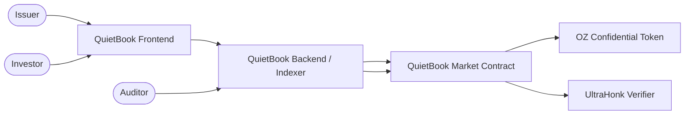

<p align="center">
  
</p>

<h1 align="center">QuietBook</h1>

<p align="center"><strong>Known investors. Private bids. Verifiable allocation.</strong></p>

<p align="center">
QuietBook lets issuers run confidential bookbuilding rounds for tokenized RWAs on Stellar<br/>
without exposing investor bids or balances to the public.
</p>

<p align="center">
  <a href="https://quiet-book-web.vercel.app">Launch Live Demo</a> ·
  <a href="docs/judge-runbook.md">Run Judge Flow</a> ·
  <a href="docs/architecture.md">Architecture</a> ·
  <a href="docs/evidence/README.md">Testnet Evidence</a> ·
  <a href="#security-and-privacy-model">Security Model</a>
</p>

<p align="center">
  
  
  
  
</p>

> QuietBook is an unaudited Stellar **Testnet** prototype. It is not suitable for production, mainnet, real securities, or real value.

---

## What you are looking at

<!-- TODO (human): replace with a current side-by-side screenshot of the Public view vs. Auditor view. -->

QuietBook applies confidential RFQ and sealed-bid mechanics to **primary** RWA issuance — the moment an asset is first priced and allocated. Identities are known and policy-approved; bid amounts, confidential balances, and the settlement amount stay sealed from the public. Authorized auditors keep the compliance visibility they need, and selective disclosure can reveal a single settlement fact to one chosen party without opening a participant's full history.

> Confidentiality, not anonymity.

---

## The problem

Primary RWA issuance still runs on email, spreadsheets, private chats, and OTC calls. Moving that on-chain naively makes every bid public, which leaks investor demand and pricing strategy. Fully anonymous systems remove that leak but fail enterprise compliance, because the issuer and its auditors must know who they are transacting with.

Issuers need private price discovery with **known** counterparties and settlement that anyone can verify occurred — without the amounts being visible.

---

## The product

An end-to-end confidential bookbuilding round:

1. An issuer creates a tokenized-asset round and escrows a fixed public RWA lot.
2. Only policy-approved investors may participate.
3. Approved investors submit sealed confidential bids.
4. Bid values and confidential balances stay hidden from the public.
5. The winning bid is selected by a fixed-capacity UltraHonk proof and verified on-chain — without revealing the losing bids.
6. The confidential winner payment settles on-chain.
7. The public RWA lot is delivered to the winner in the same settlement transaction.
8. Authorized auditors can decrypt the bids and settlement amount for compliance.
9. Selective disclosure reveals one settlement fact to one designated recipient.

| Visibility | Data |
| --- | --- |
| **Public** | Participant identities, round metadata, bid count, deadlines, transaction occurrence, winner identity, proof hash |
| **Confidential** | Bid amounts, confidential balances, settlement amount, encrypted openings |
| **Auditor-visible** | Decrypted bids, settlement value, compliance detail |

---

## Why QuietBook is different

QuietBook is **not** a generic sealed-bid demo, a private-payment wallet, or a secondary trading venue.

- A confidential-token demo proves you can hide a balance. QuietBook uses that primitive to run a **complete issuance workflow**: escrow, eligibility, sealed bids, verifiable winner selection, atomic settlement, reclaim, audit, and disclosure.
- A private wallet moves value anonymously. QuietBook keeps identities **known and policy-gated** while hiding amounts, which is what enterprise compliance requires.
- A DEX trades existing assets on a secondary market. QuietBook handles **primary issuance** — the first pricing and allocation of the asset.

> The differentiator is the application: confidential RFQ mechanics applied to primary RWA issuance, built on OpenZeppelin Confidential Tokens.

---

## Run the Judge Demo

**Live demo:** <https://quiet-book-web.vercel.app> · **Estimated time:** ~2 minutes · **Prerequisites:** none for the replay (a Freighter Testnet wallet is only needed for the optional live sandbox).

The hosted judge flow replays a previously confirmed Testnet round. It verifies real, confirmed transactions — it never presents a replay as a freshly submitted transaction.

1. Confirm the live Testnet ledger indicator resolves, then run the Testnet story.
2. Verify the completed round and watch the step-by-step receipt verification, **including the unauthorized-investor policy denial**.
3. Switch between the Public, Issuer, Investor, and Auditor perspectives. Public values stay sealed.
4. Open **Audit & disclosure** to compare public vs. authorized-auditor visibility and verify the recipient-bound disclosure.
5. Open the Testnet evidence index.
6. Optionally connect Freighter: **My access** performs a live policy read; accounts outside the fixture are reported as unauthorized.

**Optional live sandbox (`Explore live round`)** creates new controller, round, bid, settlement, and reclaim receipts. It requires funded Freighter Testnet wallets, and the first proving action initializes browser prover assets.

**Fallback if the hosted service is unavailable** — run everything locally:

```sh
pnpm install
pnpm judge
```

Then open `http://127.0.0.1:5173`. Without a reachable indexer or public RPC, the UI labels the fallback and verifies the archived round from committed evidence. Full steps: [docs/judge-runbook.md](docs/judge-runbook.md).

---

## Proven capabilities

| Capability | Proof |
| --- | --- |
| Confidential bids (sealed amounts, hidden balances) | [`testnet/round-setup.json`](docs/evidence/testnet/round-setup.json), `submit_bid` in [`contracts/market/src/lib.rs`](contracts/market/src/lib.rs) |
| Approved-participant enforcement (unauthorized rejected) | [`testnet/round-setup.json`](docs/evidence/testnet/round-setup.json), [`testnet/negative-tests.json`](docs/evidence/testnet/negative-tests.json), `EligibilityPolicy` check in `validate_bid_candidate` |
| Winning-bid verification (UltraHonk) | [`testnet/settlement.json`](docs/evidence/testnet/settlement.json), `finalize` → `MaxBidVerifierClient.verify` |
| Confidential settlement + atomic RWA delivery | [`testnet/settlement.json`](docs/evidence/testnet/settlement.json), tx [`3a47b09e…9246d`](https://stellar.expert/explorer/testnet/tx/3a47b09ea1def84f1bef4bb71a00fab2080cfb5e5697a84d86c549a97f89246d) |
| Losing-bid reclaim and pre-deadline withdrawal | [`testnet/reclaim.json`](docs/evidence/testnet/reclaim.json), [`testnet/withdrawal.json`](docs/evidence/testnet/withdrawal.json) |
| Auditor visibility | [`testnet/audit.json`](docs/evidence/testnet/audit.json) |
| Selective disclosure (recipient-bound) | [`testnet/disclosure.json`](docs/evidence/testnet/disclosure.json), `circuits/disclose_settlement` |
| Persistent indexer with redacted public API | [`apps/indexer/src/server.ts`](apps/indexer/src/server.ts), [`apps/indexer/test/indexer.test.ts`](apps/indexer/test/indexer.test.ts) |

Full evidence index: [docs/evidence/README.md](docs/evidence/README.md).

---

## Why Stellar and OpenZeppelin

**Stellar / Soroban** gives QuietBook fast, low-cost settlement and a contract platform suited to compliance-oriented financial infrastructure. The issuance round, escrow, eligibility gate, winner verification, and atomic settlement are all Soroban contracts.

**OpenZeppelin Confidential Tokens** are the confidentiality and security foundation:

- Confidential balances and transfer amounts.
- Known identities with capped, expiring **spender delegation** (`set_spender` / `revoke_spender`) bounded to the round's settlement deadline.
- Compliance hooks via an on-chain eligibility policy.
- An auditor registry enabling authorized decryption.
- Selective disclosure of individual settlement facts.
- UltraHonk verification of the winner-selection statement, where the market's public inputs are bound byte-for-byte to the confidential transfer.

OpenZeppelin provides the primitives; QuietBook is the end-user product built on top of them.

---

## Architecture summary



> See the full system design, trust boundaries, contract responsibilities, and transaction sequences in [docs/architecture.md](docs/architecture.md).

---

## Security and privacy model

- **Identities are not anonymous.** Issuer, investors, and auditor are known and policy-approved.
- **Amounts are confidential.** Bid values, confidential balances, and the settlement amount are never exposed publicly.
- **Auditor access is explicit.** A registered auditor key decrypts bids and settlement values; no implicit access exists.
- **Allowlists and policies are enforced on-chain.** An unauthorized investor's `submit_bid` is rejected by the eligibility policy before any settlement.
- **Public observers see state transitions, not private values.** Round metadata, event occurrence, winner identity, and proof hashes are public; openings are not.
- **Fail-closed authorization on the backend.** Every mutation requires a short-lived wallet-signed session, exact wallet/role match, an allowed origin, and route-specific rate limits. Production startup rejects missing or mismatched Testnet role secrets.
- **Testnet and unaudited.** No audit, no mainnet, no production custody claim.

Details and trust boundaries: [docs/architecture.md](docs/architecture.md#5-privacy-and-trust-boundary).

---

## Repository map

| Path | Responsibility |
| --- | --- |
| `contracts/market` | Issuance round lifecycle, escrow, eligibility gate, UltraHonk winner verification, atomic settlement |
| `contracts/round-controller` | Round-specific controller that registers with the token and performs the confidential settlement transfer |
| `contracts/eligibility-policy` | On-chain approved-participant policy |
| `contracts/confidential-*` | Confidential token, verifier, and auditor integration |
| `contracts/max-bid-verifier` | On-chain UltraHonk verifier for the Max-Bid statement |
| `circuits/max_bid`, `circuits/disclose_settlement` | Noir circuits for winner selection and selective disclosure |
| `packages/sdk` | TypeScript SDK: accounts, proofs, disclosure, audit, payload binding |
| `apps/indexer` | Node.js indexer + sandbox coordinator (auth, redacted API, SQLite, private vault) |
| `apps/web` | React frontend: judge replay, role views, audit/disclosure, live sandbox |
| `ops/digitalocean` | Production backend runbook (Docker, Caddy, backup, restore, rollback) |
| `docs/evidence/testnet` | Recorded Testnet evidence artifacts |

---

## Local development

Prerequisites: Node.js 22.13+ and pnpm 10.33, Rust 1.92 (stable), Stellar CLI 27.

```sh
pnpm install
pnpm judge
```

Open `http://127.0.0.1:5173`. The indexer starts on `http://127.0.0.1:8787`, syncs before listening, then refreshes every 30 seconds.

Related docs: [local & hosting model](docs/deployment.md) · [DigitalOcean backend runbook](ops/digitalocean/README.md) · [environment configuration](docs/deployment.md) · [implementation order](docs/implementation-order.md).

---

## Verification

Run the full clean-checkout suite:

```sh
pnpm bootstrap
pnpm install --frozen-lockfile
pnpm test
```

Targeted commands:

```sh
pnpm test:contracts   # Soroban contract tests (cargo)
pnpm test:circuits    # Noir circuit tests (max_bid, disclose_settlement)
pnpm test:sdk         # SDK unit tests
pnpm test:proof       # real UltraHonk proofs
pnpm test:indexer     # indexer redaction & auth
pnpm test:privacy     # public-privacy scan
pnpm build:web        # production web build
pnpm test:web         # frontend judge E2E (desktop + mobile)
```

The Testnet auditor and disclosure reproductions use ignored local secrets and are intentionally separate from the clean-checkout suite:

```sh
pnpm audit:round:testnet
pnpm disclose:settlement:testnet
```

Production smoke tests (Docker health/auth/CORS and live checks) are documented in the [DigitalOcean runbook](ops/digitalocean/README.md).

---

## Scope and limitations

- Stellar **Testnet** prototype; **unaudited**; not for real assets or value.
- **Not anonymous** — identities are known by design.
- Not a general DEX or secondary-market venue.
- No cross-chain support.
- Fixed capacity of **`N=3`** bidders per round; single-winner allocation only.
- No partial fills and no multi-winner allocation.
- In this MVP, the operator learns bid openings in order to produce the Max-Bid proof (documented in [docs/architecture.md](docs/architecture.md#5-privacy-and-trust-boundary)).
- No production custody model.

---

## More documentation

[Architecture](docs/architecture.md) · [Judge runbook](docs/judge-runbook.md) · [Evidence index](docs/evidence/README.md) · [Deployment](docs/deployment.md) · [DigitalOcean runbook](ops/digitalocean/README.md) · [Integration spike notes](docs/architecture/0001-p0-integration-spike.md)
</content>
<parameter name="task_progress">- [x] Inspect repo (README, docs, contracts, backend, config, auth, evidence, scripts)
- [x] Build implementation inventory
- [x] Rewrite README.md
- [ ] Create docs/architecture.md
- [ ] Validate links + Mermaid
- [ ] List remaining human TODOs