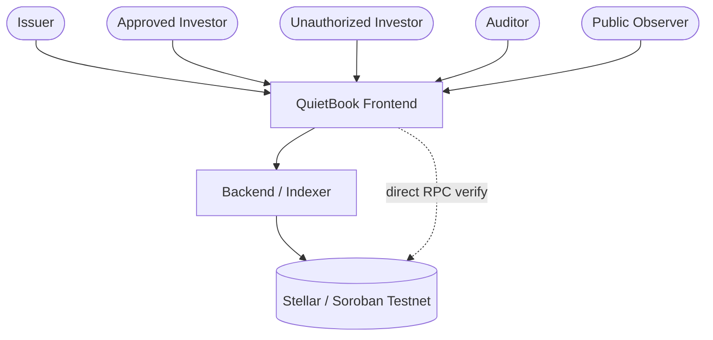
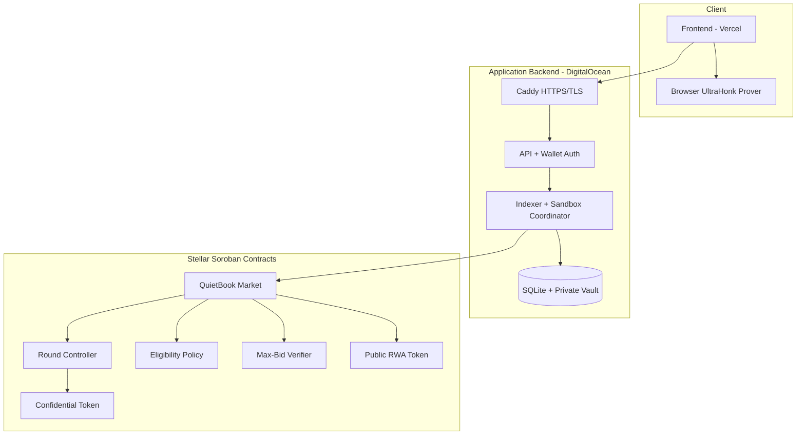
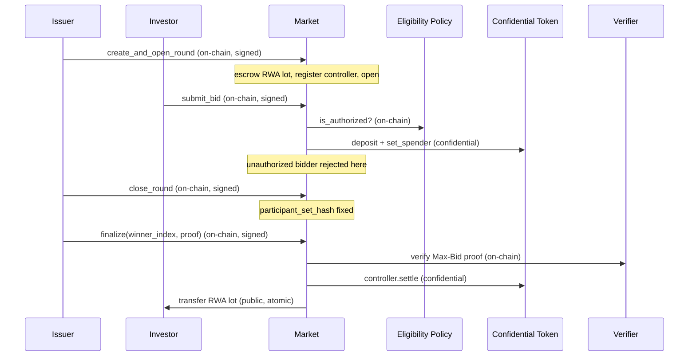
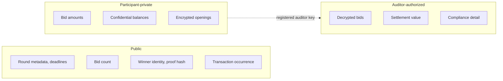

# QuietBook architecture

QuietBook is a confidential bookbuilding and primary-issuance application for tokenized RWAs on Stellar. This document describes what runs where, what is public or confidential, who signs what, which contract enforces each rule, and where trust is placed.

QuietBook is an unaudited Stellar **Testnet** prototype. Nothing here describes a production or mainnet system.

Component names are used consistently throughout: **Frontend** (React web app), **Backend/Indexer** (Node.js service), **Market** (`QuietBookMarket` contract), **Controller** (round controller contract), **Confidential Token** (OpenZeppelin), **Verifier** (Max-Bid UltraHonk verifier), **Eligibility Policy**, and **Auditor**.

---

## 1. Architecture goals

- Keep bid amounts, confidential balances, and the settlement value confidential.
- Restrict participation to known, policy-approved accounts.
- Select the winner with a verifiable UltraHonk proof rather than trust.
- Preserve auditor visibility into the confidential values.
- Support selective disclosure of a single settlement fact to one recipient.
- Fail closed on authorization: reject before settling.
- Produce reproducible Testnet evidence.
- Offer a self-guided judge experience that needs no wallet for the replay.

---

## 2. System context

- **Issuer** creates and opens a round, escrows the RWA lot, closes the round, and finalizes settlement.
- **Approved investor** submits a sealed confidential bid and can withdraw before the deadline or reclaim after losing.
- **Unauthorized investor** is rejected by the on-chain eligibility policy before any state change.
- **Auditor** uses a registered key to decrypt bids and settlement values for compliance.
- **Public observer** sees round metadata, event occurrence, winner identity, and proof hashes — never the amounts.
- The **Frontend** can verify the archived round directly through Stellar RPC when the backend is unavailable.

---

## 3. Component architecture

- **Client**: the Vercel-hosted React app and an in-browser UltraHonk prover for bid and reclaim proofs. Confidential keys stay in the browser.
- **Application backend**: Caddy terminates TLS and proxies to the private API on port 8787. The API enforces wallet-signed sessions, CORS, and rate limits; the indexer syncs on-chain events into SQLite and coordinates the live sandbox; the private vault holds settlement witnesses under ignored `.quietbook/` state.
- **Stellar contracts**: the Market orchestrates the lifecycle and calls the Controller, Eligibility Policy, Verifier, Confidential Token, and public RWA token.
- **External infrastructure**: Stellar Testnet RPC and Freighter (client-side signing) sit outside these boundaries.

The auditor registry is realized through the Confidential Token / confidential-auditor integration; there is no separate auditor microservice.

---

## 4. End-to-end issuance sequence

- **Off-chain**: proof generation (browser or operator), indexing, evidence persistence.
- **Wallet-signed**: `create_and_open_round`, `submit_bid`, `withdraw_bid`, `close_round`, `finalize`, `reclaim_rwa` — each calls `require_auth` on the issuer or bidder.
- **On-chain**: eligibility check, delegation liveness check, proof verification, settlement, RWA transfer.
- **Confidential**: bid deposit, spender delegation, and the settlement transfer amount.
- **Public**: round metadata, event emission, winner identity, proof hash, RWA delivery.

The Market builds the Max-Bid public inputs (`build_max_bid_public_inputs`) from the on-chain allowance commitments, reserve, winner index, and the confidential transfer ciphertext, so the verified statement is bound byte-for-byte to the settlement transfer.

---

## 5. Privacy and trust boundary

**Public**: participant identities, round metadata, bid count, deadlines, transaction occurrence, winner identity, and the proof hash.

**Confidential**: bid amounts, confidential balances, the settlement amount, and encrypted openings/ciphertexts.

**Auditor-authorized**: decrypted bids, the settlement value, and compliance detail — reachable only with the registered auditor key.

**Trust assumptions:**

- **Backend/operator** is trusted to run the sandbox coordinator and, in this MVP, learns bid openings in order to produce the Max-Bid proof. This is the main confidentiality assumption and is a known limitation.
- **Private vault** (`.quietbook/`) holds settlement witnesses and operator state; it is never exposed by the public API, which redacts raw XDR and decoded confidential payloads.
- **Wallet ownership**: each actor controls its own Freighter key; the backend never holds investor keys.
- **Auditor key**: whoever holds the registered auditor key can decrypt confidential values; the registry entry is explicit on-chain.
- **Indexer consistency**: the indexer reflects on-chain state and can lag; the frontend can fall back to direct RPC verification.
- **Proof verification boundary**: winner correctness is enforced on-chain by the Max-Bid verifier, not by the backend.
- **Contract upgrades**: Testnet deployment; no upgrade-governance or immutability guarantees are claimed for production.

---

## 6. Contract responsibilities

| Contract | Responsibility | Security boundary |
| --- | --- | --- |
| `QuietBookMarket` (`contracts/market`) | Round lifecycle (`create_and_open_round`, `submit_bid`, `withdraw_bid`, `close_round`, `finalize`, `reclaim_rwa`, `mark_no_sale`, `cancel_round`), RWA escrow, eligibility gate, proof verification, atomic settlement | Requires issuer/bidder `require_auth`; rejects unauthorized, expired, duplicate, over-capacity, and invalid-proof cases with typed errors |
| Round Controller (`contracts/round-controller`) | Round-specific account that registers with the Confidential Token and executes the confidential `settle` transfer | Configuration must match the Market, token, issuer, and settlement deadline before opening |
| Eligibility Policy (`contracts/eligibility-policy`) | `is_authorized(account, token)` allowlist check | Called inside `validate_bid_candidate`; unauthorized bids revert before any deposit |
| Confidential Token (`contracts/confidential-token`, OZ) | Confidential balances, `deposit`, `set_spender` / `revoke_spender` (capped, expiring), auditor registry | Delegation must be live until the settlement deadline; enforced at bid registration and close |
| Max-Bid Verifier (`contracts/max-bid-verifier`) | On-chain UltraHonk verification of the winner statement | `finalize` reverts with `MaxProofInvalid` if verification fails |
| Confidential Verifier / Auditor (`contracts/confidential-*`) | Proof plumbing and auditor decryption support | Auditor visibility is explicit via registered key |
| Public RWA Token | Standard Soroban token holding the escrowed lot | Transferred only by the Market on settlement or reclaim |

Function and error names are taken directly from the implementation (`MarketError` variants such as `InvestorNotAuthorized`, `BidCapacityReached`, `MaxProofInvalid`, `SettlementDeadlinePassed`).

---

## 7. Data model and lifecycle

**Round status** (`RoundStatus`): `Draft → Open → Closed → Settled`, with `Failed` and `Cancelled` as terminal off-paths. `mark_no_sale` moves a closed round with no viable winner to `Failed`; `reclaim_rwa` returns the escrowed lot and lands in `Cancelled`.

| Entity | States / lifecycle |
| --- | --- |
| Issuance round | Draft, Open, Closed, Settled, Failed, Cancelled |
| Investor registration | Not registered → registered/active → withdrawn (inactive) |
| Sealed bid | Deposited + delegated (active) → reclaimed/revoked, or selected as winner |
| Allowance / delegation | Set with cap and `live_until_ledger` ≥ settlement deadline → revoked |
| Proof | Generated off-chain → verified on-chain in `finalize` → `proof_hash` stored |
| Settlement | Pending → executed atomically with RWA delivery |
| Disclosure | Generated for one recipient/nonce/event → verified against pinned VK |

Capacity is fixed at `MAX_BIDDERS = 3`. The `participant_set_hash` is computed at `close_round` and binds the proof to the exact active bidder set.

---

## 8. Authentication and authorization

- **Wallet signing (Freighter)**: all on-chain mutations are signed client-side; contracts enforce `require_auth`.
- **Backend session model** (`apps/indexer/src/auth.ts`): the client requests a challenge (`/api/auth/challenge`), signs the message with its Stellar key, and exchanges it (`/api/auth/verify`) for an HMAC-signed bearer token. Challenge TTL is 5 minutes; session TTL is 2 hours.
- **Role binding**: mutation routes assert the session wallet matches the acting account/issuer (`assertActor`), so a valid session cannot act for another wallet.
- **Roles**: issuer (creates/opens/closes/settles), investor (bids/withdraws/reclaims), auditor (decrypts via registered key), backend/operator (runs the sandbox coordinator and holds the private vault).
- **Replay protection**: single-use nonces stored server-side and deleted on verify; signature must be 64 bytes and validate against the account key; audience and version are checked on every request.
- **CORS**: only origins in `QUIETBOOK_ALLOWED_ORIGINS` receive an `access-control-allow-origin`; disallowed origins are rejected with `origin_not_allowed`.
- **Rate limits**: separate limiters for general requests, auth, mutations, and expensive operations (prepare/settle).
- **Secret storage**: session secret and Testnet role secrets come from environment variables; production startup (`assertProductionConfig`) rejects a short session secret, missing allowed origins/audience, or role secrets that do not match the deployed public keys.

---

## 9. Deployment topology

- **Frontend host**: Vercel (`https://quiet-book-web.vercel.app`), static build; the backend URL is embedded at build time via `VITE_INDEXER_URL`.
- **Backend host**: DigitalOcean Droplet, region Frankfurt (`fra1`).
- **TLS termination**: Caddy HTTPS proxy in front of the private indexer on port 8787.
- **Containers/services**: production Docker image (Node.js 24, Stellar CLI 27) via Docker Compose, plus Caddy.
- **Persistent paths**: `quietbook-data` volume holding the SQLite database and private vault, retained across deploys.
- **Backups / restore / rollback**: scripts and a systemd timer under `ops/digitalocean` (`backup.sh`, `restore.sh`, `rollback.sh`, `quietbook-backup.timer`).
- **Health checks**: `/health` (liveness and sync state) and `/ready` (deployment readiness, requires controller Wasm present).

Full provisioning, secrets, firewall, and release procedure: [../ops/digitalocean/README.md](../ops/digitalocean/README.md). Administrative secrets are not documented here.

---

## 10. Failure modes

| Failure | System behavior |
| --- | --- |
| Invalid proof | `finalize` reverts (`MaxProofInvalid`); round stays `Closed`. Rejects. |
| Unauthorized investor | `submit_bid` reverts (`InvestorNotAuthorized`) before deposit. Rejects. |
| Expired round | Bids past `bid_deadline_ledger` revert (`BidDeadlinePassed`); settlement past deadline reverts (`SettlementDeadlinePassed`). Rejects. |
| Duplicate bid | Second registration reverts (`BidAlreadyRegistered`). Rejects. |
| Over-capacity bid | A 4th bidder reverts (`BidCapacityReached`). Rejects. |
| Delegation expired / missing at close | `close_round` deactivates the bidder and emits `BidWithdrawn`. Reconciles. |
| Failed settlement | Round remains `Closed`; issuer can retry `finalize` before the deadline or `mark_no_sale` after. Retries / operator. |
| Indexer lag | Public reads may trail chain; frontend falls back to direct RPC verification. Reconciles. |
| Backend restart | State persists on the `quietbook-data` volume; indexer re-syncs on start before listening. Reconciles. |
| Corrupted local state | Private vault under `.quietbook/`; restore from backup. Operator. |
| Unavailable auditor data | Auditor reproduction uses local secrets; absence blocks decryption but does not affect chain state. Operator. |
| Replay attempt | Reused or expired nonce/session is rejected at auth. Rejects. |

---

## 11. Known limitations

- Stellar **Testnet** prototype; **unaudited**; not for real assets or value.
- **Not anonymous** — identities are known by design.
- Not a general DEX or secondary-market venue.
- No cross-chain support.
- Fixed capacity of **`N=3`** bidders per round; single-winner allocation only.
- No partial fills and no multi-winner allocation.
- In this MVP, the operator learns bid openings in order to produce the Max-Bid proof.
- No production custody model.

These match the README exactly; see [../README.md](../README.md#scope-and-limitations).
</content>
<parameter name="task_progress">- [x] Inspect repo (README, docs, contracts, backend, config, auth, evidence, scripts)
- [x] Build implementation inventory
- [x] Rewrite README.md
- [x] Create docs/architecture.md
- [ ] Validate links + Mermaid
- [ ] List remaining human TODOs